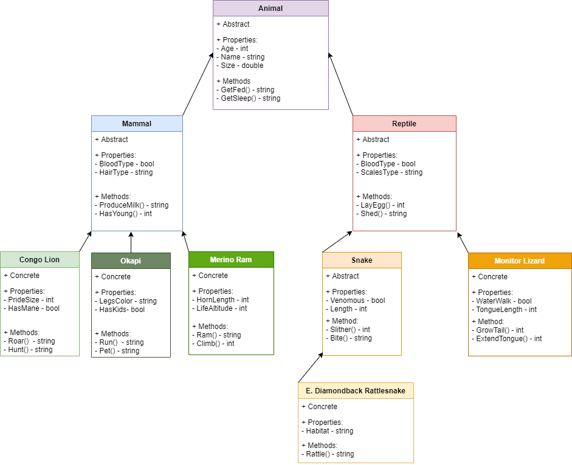
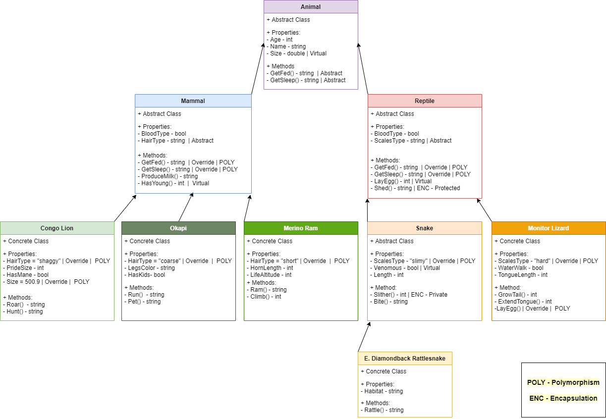

# OOP Application README

Lab06-OOP and Lab07-OOP

---

##### Authors: Robert Carter, Na'ama Bar-Ilan

---

### Description

This is a C# console application that will utilize UML to plan an application that will incorporate both Inheritance and Abstraction. There are several abstract and concrete objects that are tied together utilizing inheritance, with values being shared due to abstraction. 

We first created the base class Animal, then created several subsidiary levels of classes that have an inheritance relationship (derived classes) with those above it. For example, Mammals and Reptiles are two created classes that inherit from the base class Animals, while several animal classes inherit from Mammals, Reptile, and Animal. We tested these relationships by creating several basic methods found within each class and testing them within the concrete animal classes. They were all able to run inherited methods from Animal, Mammal, and Reptile.

We further augmented select properties and methods utilizing both Polymorphism and Encapsulation to show off the full suite of OOP principles. For example, the Animal class's two methods were changed to abstract methods which were then utilizied by its derived classes Mammal and Reptile via override to create their own unique returns. We also used virtual classes to modify return values within specific classes, but not others who used the same method. Finally, we created a protected method who's usage was not allowed outside of the specific class.

#### Getting started

##### Clone this repository to your local machine.
###### $ git clone https://github.com/racarter1215/Lab06-OOP.git

### To run this application from VS:

##### Select File, then Open, then Project/Solution
##### Find the location of the cloned Repository
##### Select Lab06OOP folder
##### Select the next Lab06OOP folder
##### Select the Program.cs document

### Lab 06 Application WhiteBoard

### Lab 07 Application WhiteBoard

### Technical Definitions
##### OOP Principles: Object Oriented Programming Principles, these are the fundamentals that allow us to differentiate objects with similar behavior.
##### Inheritance: The act of providing info to a derived class from a base class. This is the process of having one class take the properties and methods of another class
###### Examples of Inheritance in this project: Rattlesnake is a derived class that inherits both properties and methods from its base classes: Snake, Reptile, and Animal. One such example is the LayEgg method, which is a Reptile method that can be called by Rattlesnake.
##### Abstraction: The grouping of data that is used as a template for derived classes and can be seen without instantiating it. 
###### Examples of Abstraction in this project: The abstract classes in this project were Animal, Mammal, Reptile, and Snake. Taking Animal as an example, as an abstract class it's properties and methods were inherited by all of its derived classes. You can't instantiate and Animal itself, but you can instantiate it's derived classes using Animal properties and methods.
##### Polymorphism: That which allows different objects to have unique values when it is called in different methods. In essence, you can change the contents of methods found in derived classes.
###### Examples of Polymorphism in this project: The GetFed() and GetSleep() methods within the base class Animal utilized Polymorphism to change their string values so that the derived classes Mammal and Reptile had different values returned for each method. Also, the HairType() method from Mammal and the ScalesType() method from Reptile utilized Polymorphism to create individual values for all of their specific derived classes.
##### Encapsulation: This concept enables an object to conceal data, such as a method, from other objects. It allows a class to keep its data without sharing it to derived classes, or only specific derived classes, for example. 
###### Examples of Encapsulation in this project: The method Slither() found in the Snake abstract class was protected and was unable to be utilized by its derived class E. Diamondback Rattlesnake.

#### Change Log
###### 1.3: Updated app with vitrual and abstract methods and properties utilizing override - 14 July 2020
###### 1.2: Updated UML picture and code comments - 14 July 2020
###### 1.1: App first created - 13 July 2020
